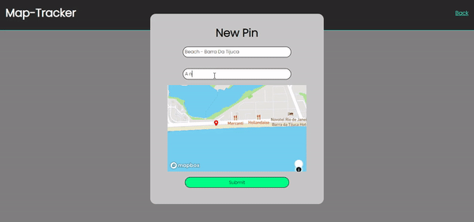

## Simple Travel-Map project with `MERN Stack`

## This project made for study ReactJS

    

# To start, install the dependencies, go to the MapBox website and create an account, get the access token and go to client/components/Map/index and place where indicated. ( Line 58 )

*Made by: Leandro Silva*
